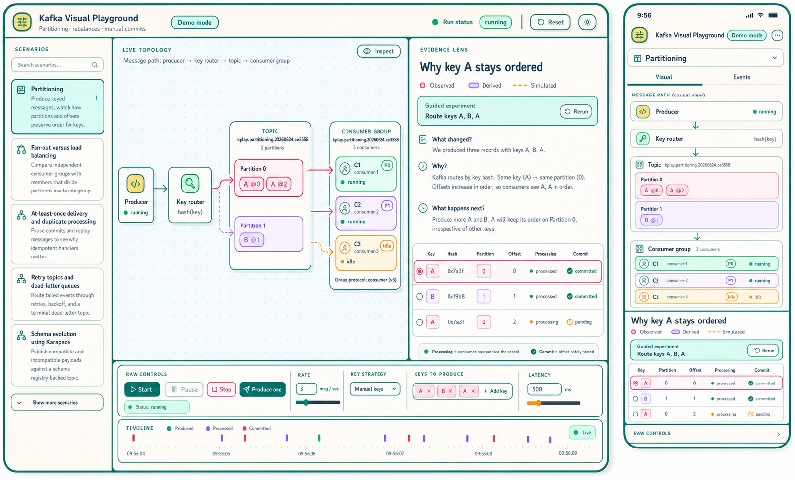
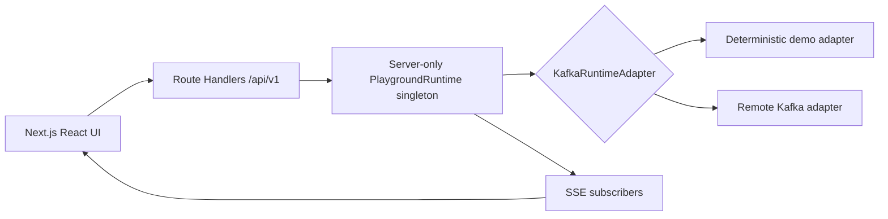

# Kafka Visual Playground

Kafka Visual Playground is a scenario-driven learning app for Kafka partitioning, ordering, consumer-group rebalancing, offset commits, delivery guarantees, retention, compaction, stream processing, and operational Kafka patterns.

The app ships with a deterministic local demo mode and an optional user-configured remote Kafka mode. Demo mode is designed for repeatable learning and automated verification; remote mode creates real Kafka resources and shows observed delivery reports, assignments, and commits.

## Scenario Catalog

The current catalog includes:

- Partitioning, Ordering, and Consumer Rebalancing
- Consumer-group load balancing
- At-least-once delivery and duplicate processing
- Retry topics and dead-letter queues
- Schema evolution using Karapace
- Idempotent and transactional producers
- Event replay and event sourcing
- Consumer lag and backpressure
- Hot partitions and key skew
- Log compaction and tombstones
- Retention windows and data loss
- Rebalance strategies and cooperative sticky assignment
- Kafka Streams joins and windows
- Outbox pattern and CDC
- ACLs, users, and least privilege

## Screenshots

Scenario catalog:


Partitioning teaching-first lesson:


Hot partition comparison:


Teaching-first visualization V2 concept:



## Architecture



Next.js serves both the UI and API, but Kafka clients are owned only by the centralized server runtime. The app must run as one persistent Node.js process for the current runtime model.

## Requirements

- Node.js 22 or newer
- npm
- Optional: a remote Kafka service with SASL credentials

## Setup

```bash
npm install
npm run dev:demo
```

Open `http://localhost:3000` for the catalog or `http://localhost:3000/scenarios/partitioning` for the primary scenario.

To customize local settings, copy `.env.example` to `.env.local` and edit the copy. Demo mode works without external Kafka credentials.

For a local production preview, build first and then run the standalone server entrypoint emitted by Next.js:

```bash
npm run build
mkdir -p apps/web/.next/standalone/apps/web/.next/static
cp -R apps/web/.next/static/. apps/web/.next/standalone/apps/web/.next/static/
PORT=3000 node apps/web/.next/standalone/apps/web/server.js
```

If the app adds an `apps/web/public` directory later, copy it to `apps/web/.next/standalone/apps/web/public` before starting the standalone server.

## Remote Kafka Mode

Open a scenario, choose **Remote Kafka**, and configure the connection in the web drawer. Remote mode supports comma-separated brokers, SASL username/password, `PLAIN`, `SCRAM-SHA-256`, or `SCRAM-SHA-512`, TLS on/off, and optional CA certificate text for providers that require a custom CA.

The browser saves the remote connection form in `localStorage`, including the password, so users can revisit the playground without retyping it. The server receives the config only for connection tests and active runs, stores it only in memory for the current Node.js process, and never returns raw usernames, passwords, certificate text, or raw Kafka configuration in API responses.

For server-configured Aiven smoke tests and cleanup workflows, configure:

```env
KAFKA_MODE=aiven
AIVEN_KAFKA_BROKERS=host:port
AIVEN_KAFKA_USERNAME=
AIVEN_KAFKA_PASSWORD=
AIVEN_KAFKA_SASL_MECHANISM=SCRAM-SHA-256
AIVEN_KAFKA_CA_PATH=./certs/ca.pem
KAFKA_TOPIC_PREFIX=kplay
```

Connection tests return only sanitized status, masked broker host, broker count, topic count when available, and sanitized errors.

## Environment Variables

| Variable                     | Default          | Purpose                                                                                                                 |
| ---------------------------- | ---------------- | ----------------------------------------------------------------------------------------------------------------------- |
| `KAFKA_MODE`                 | `demo`           | Selects deterministic demo mode or live `aiven` mode.                                                                   |
| `AIVEN_KAFKA_BROKERS`        | empty            | Comma-separated Aiven broker host and port list. Required in Aiven mode.                                                |
| `AIVEN_KAFKA_USERNAME`       | empty            | Aiven service user. Required in Aiven mode.                                                                             |
| `AIVEN_KAFKA_PASSWORD`       | empty            | Aiven service password. Required in Aiven mode.                                                                         |
| `AIVEN_KAFKA_SASL_MECHANISM` | `SCRAM-SHA-256`  | One of `PLAIN`, `SCRAM-SHA-256`, or `SCRAM-SHA-512`.                                                                    |
| `AIVEN_KAFKA_CA_PATH`        | `./certs/ca.pem` | CA certificate path used by the Aiven adapter.                                                                          |
| `KAFKA_TOPIC_PREFIX`         | `kplay`          | Prefix for run topics and consumer groups. Use lowercase letters, numbers, dots, dashes, or underscores; max length 32. |
| `MAX_CONSUMERS_PER_RUN`      | `10`             | Caps active consumers per run before scenario-specific limits apply. Values above 10 are rejected.                      |
| `MAX_PRODUCE_RATE`           | `10`             | Caps producer rate per run. Values above 10 are rejected.                                                               |
| `EVENT_HISTORY_LIMIT`        | `2000`           | Max server-side SSE/runtime event history. Values above 5000 are rejected.                                              |
| `TIMELINE_DISPLAY_LIMIT`     | `1000`           | Max events included in run snapshots for the timeline. Values above 2000 are rejected.                                  |
| `LOG_MESSAGE_PAYLOADS`       | `false`          | Enables message payload logging when explicitly set.                                                                    |
| `LOG_LEVEL`                  | `info`           | Pino logger level for server logs.                                                                                      |
| `PORT`                       | `3000`           | Port used by Next.js commands.                                                                                          |
| `RUN_AIVEN_E2E`              | `false`          | Enables the optional live Aiven smoke test when set to `true`.                                                          |

## API Surface

The UI uses the versioned `/api/v1` routes directly:

| Method   | Route                                             | Behavior                                                                                                                                  |
| -------- | ------------------------------------------------- | ----------------------------------------------------------------------------------------------------------------------------------------- |
| `GET`    | `/api/v1/health`                                  | Returns process health.                                                                                                                   |
| `GET`    | `/api/v1/scenarios`                               | Returns the scenario catalog.                                                                                                             |
| `GET`    | `/api/v1/connection`                              | Returns sanitized Kafka connection status.                                                                                                |
| `POST`   | `/api/v1/connection/test`                         | Re-runs the sanitized connection check.                                                                                                   |
| `GET`    | `/api/v1/runs`                                    | Returns the active run snapshot or `null`.                                                                                                |
| `POST`   | `/api/v1/runs`                                    | Creates a run for `{ "scenarioId": "partitioning" }`; only one active run is supported.                                                   |
| `GET`    | `/api/v1/runs/:runId`                             | Returns a run snapshot.                                                                                                                   |
| `DELETE` | `/api/v1/runs/:runId`                             | Deletes a run and requests resource cleanup.                                                                                              |
| `GET`    | `/api/v1/runs/:runId/events`                      | Opens the SSE stream for snapshots, live events, heartbeats, and bounded-history replay via `Last-Event-ID`.                              |
| `PATCH`  | `/api/v1/runs/:runId/settings`                    | Updates `productionRate`, `keyStrategy`, or `processingLatencyMs`.                                                                        |
| `POST`   | `/api/v1/runs/:runId/messages`                    | Produces one message, optionally with an override `keyStrategy`.                                                                          |
| `POST`   | `/api/v1/runs/:runId/experiments/:experimentId`   | Runs one deterministic, serialized demo experiment and returns authoritative scenario state; unsupported remote experiments return `409`. |
| `POST`   | `/api/v1/runs/:runId/producer/start`              | Starts scheduled production.                                                                                                              |
| `POST`   | `/api/v1/runs/:runId/producer/pause`              | Pauses scheduled production.                                                                                                              |
| `POST`   | `/api/v1/runs/:runId/producer/stop`               | Stops scheduled production.                                                                                                               |
| `POST`   | `/api/v1/runs/:runId/consumers`                   | Adds one consumer to the run.                                                                                                             |
| `DELETE` | `/api/v1/runs/:runId/consumers/:consumerId`       | Removes a consumer.                                                                                                                       |
| `POST`   | `/api/v1/runs/:runId/consumers/:consumerId/crash` | Simulates a consumer crash.                                                                                                               |
| `POST`   | `/api/v1/runs/:runId/reset`                       | Stops producers, disconnects consumers, closes SSE subscribers, and requests resource cleanup.                                            |

Routes that accept JSON bodies use these shapes:

```text
POST /api/v1/runs
{ "scenarioId": "partitioning" }

PATCH /api/v1/runs/:runId/settings
{
  "productionRate": 5,
  "keyStrategy": { "type": "fixed", "value": "user-1" },
  "processingLatencyMs": 500
}

POST /api/v1/runs/:runId/messages
{
  "keyStrategy": { "type": "round_robin_users" }
}
```

`scenarioId` defaults to `partitioning`. The `settings` and `messages` fields are optional; omitted settings keep their current values.

## Resource Naming

Run resources use:

```text
<prefix>.<scenario>.<UTC date>.<random suffix>
```

Example:

```text
kplay.partitioning.20260624.ab12cd
kplay.partitioning.20260624.ab12cd.workers
```

Reset and run deletion stop producers, clear timers, disconnect runtime resources, close SSE subscribers, and request topic deletion.

## Cleanup CLI

```bash
npm run kafka:cleanup -- --dry-run
npm run kafka:cleanup -- --confirm
```

The CLI only targets topics that start with the configured prefix and refuses to delete anything outside that prefix. In demo mode it exits without deleting anything. In Aiven mode, load `.env.local` or export the Aiven variables first:

```bash
set -a; source .env.local; set +a; npm run kafka:cleanup -- --dry-run
```

## Commands

```bash
npm run dev
npm run dev:demo
npm run build
npm run lint
npm run typecheck
npm test
npm run test:e2e
```

The web workspace intentionally builds with `next build --webpack` and pins the current Next canary exactly. Keep both choices paired until the Vercel build issue that required the webpack path is retired, and run `npm run build` before changing either value.

`npm run start` delegates to `next start` and may print a warning when `output: "standalone"` is enabled. Prefer the standalone server command from the setup section after `npm run build`.

To run the optional live Aiven smoke test after configuring `.env.local` and `certs/ca.pem`:

```bash
set -a; source .env.local; set +a; npm test -- packages/kafka-runtime/src/aiven-smoke.test.ts
```

## Security Notes

- Do not commit `.env` files or Kafka certificates.
- Message payload logging is disabled by default.
- Kafka errors are sanitized before they are returned or printed.
- Route Handlers run in the Node.js runtime and delegate to server-only runtime modules.

## Known MVP Limitations

- Demo mode simulates Kafka behavior deterministically, including scenario-specific outcomes such as retry failures, schema incompatibility, authorization denial, lag, skew, tombstones, retention windows, and windowed joins.
- Consumer crashes are simulated in demo mode and represented as forced consumer disconnects in remote Kafka mode.
- The optional real-Aiven smoke test is gated by `RUN_AIVEN_E2E=true` and requires live service credentials plus `certs/ca.pem`.
