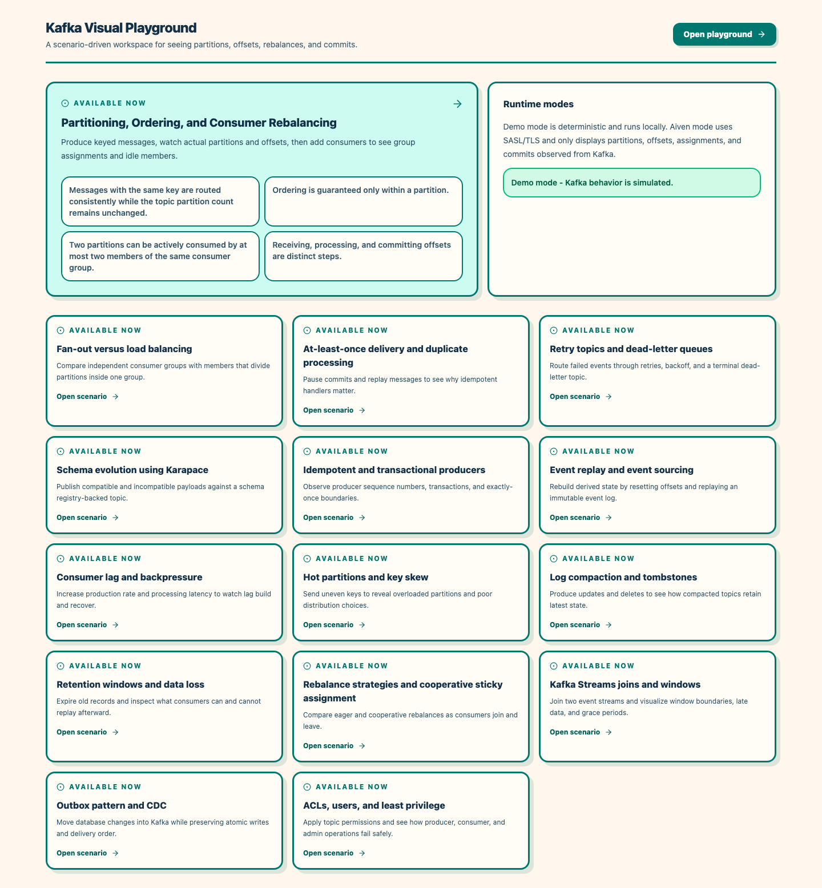
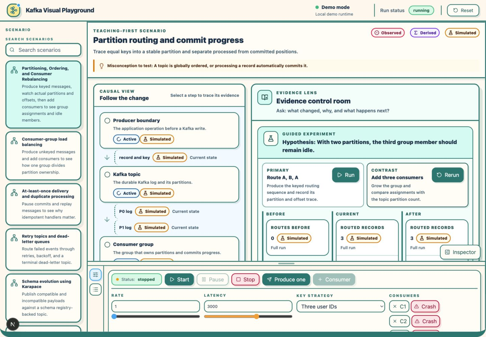
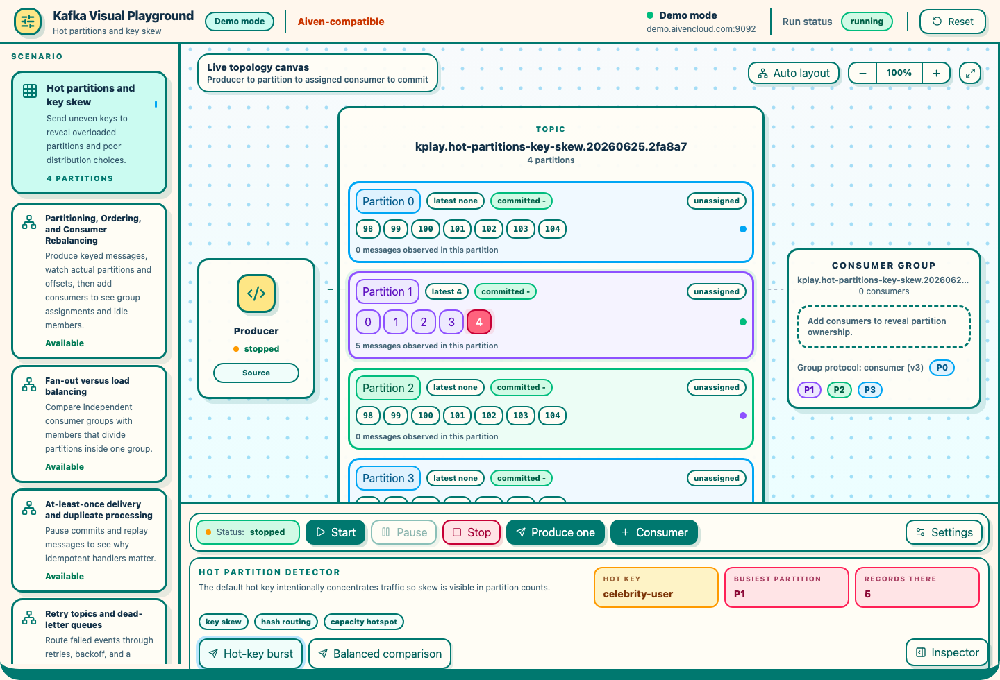
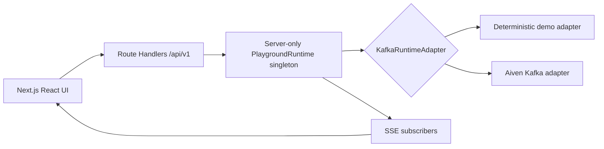

# Kafka Visual Playground

Kafka Visual Playground is a scenario-driven learning app for Kafka partitioning, ordering, consumer-group rebalancing, offset commits, delivery guarantees, retention, compaction, stream processing, and operational Kafka patterns.

The app ships with a deterministic local demo mode and an optional Aiven for Apache Kafka mode. Demo mode is designed for repeatable learning and automated verification; Aiven mode creates real Kafka resources and shows observed delivery reports, assignments, and commits.

## Scenario Catalog

The current catalog includes:

- Partitioning, Ordering, and Consumer Rebalancing
- Consumer-group load balancing
- At-least-once delivery and duplicate processing
- Retry topics and dead-letter queues
- Schema evolution using Karapace
- Idempotent and transactional producers
- Event replay and event sourcing
- Consumer lag and backpressure
- Hot partitions and key skew
- Log compaction and tombstones
- Retention windows and data loss
- Rebalance strategies and cooperative sticky assignment
- Kafka Streams joins and windows
- Outbox pattern and CDC
- ACLs, users, and least privilege

## Screenshots

Scenario catalog:



Partitioning run with message inspector:



Hot partition detector:



## Architecture



Next.js serves both the UI and API, but Kafka clients are owned only by the centralized server runtime. The app must run as one persistent Node.js process for the current runtime model.

## Requirements

- Node.js 22
- npm
- Optional: Aiven for Apache Kafka service and `certs/ca.pem`

## Setup

```bash
npm install
npm run dev:demo
```

Open `http://localhost:3000` for the catalog or `http://localhost:3000/scenarios/partitioning` for the primary scenario.

## Aiven Mode

Create an Aiven for Apache Kafka service, create a service user, copy the SASL/TLS broker URL, and download the CA certificate to `certs/ca.pem`.

Configure:

```env
KAFKA_MODE=aiven
AIVEN_KAFKA_BROKERS=host:port
AIVEN_KAFKA_USERNAME=
AIVEN_KAFKA_PASSWORD=
AIVEN_KAFKA_SASL_MECHANISM=SCRAM-SHA-256
AIVEN_KAFKA_CA_PATH=./certs/ca.pem
KAFKA_TOPIC_PREFIX=kplay
```

The browser never receives usernames, passwords, certificate contents, or raw Kafka configuration. The connection test returns only sanitized status, masked broker host, broker count, topic count when available, and sanitized errors.

## Resource Naming

Run resources use:

```text
<prefix>.<scenario>.<UTC date>.<random suffix>
```

Example:

```text
kplay.partitioning.20260624.ab12cd
kplay.partitioning.20260624.ab12cd.workers
```

Reset and run deletion stop producers, clear timers, disconnect runtime resources, close SSE subscribers, and request topic deletion.

## Cleanup CLI

```bash
npm run kafka:cleanup -- --dry-run
npm run kafka:cleanup -- --confirm
```

The CLI only targets topics that start with the configured prefix and refuses to delete anything outside that prefix.

## Commands

```bash
npm run dev
npm run dev:demo
npm run build
npm run start
npm run lint
npm run typecheck
npm test
npm run test:e2e
```

To run the optional live Aiven smoke test after configuring `.env.local` and `certs/ca.pem`:

```bash
set -a; source .env.local; set +a; npm test -- packages/kafka-runtime/src/aiven-smoke.test.ts
```

## Security Notes

- Do not commit `.env` files or Kafka certificates.
- Message payload logging is disabled by default.
- Kafka errors are sanitized before they are returned or printed.
- Route Handlers run in the Node.js runtime and delegate to server-only runtime modules.

## Known MVP Limitations

- Demo mode simulates Kafka behavior deterministically, including scenario-specific outcomes such as retry failures, schema incompatibility, authorization denial, lag, skew, tombstones, retention windows, and windowed joins.
- Consumer crashes are simulated in demo mode and represented as forced consumer disconnects in Aiven mode.
- The optional real-Aiven smoke test is gated by `RUN_AIVEN_E2E=true` and requires live service credentials plus `certs/ca.pem`.
